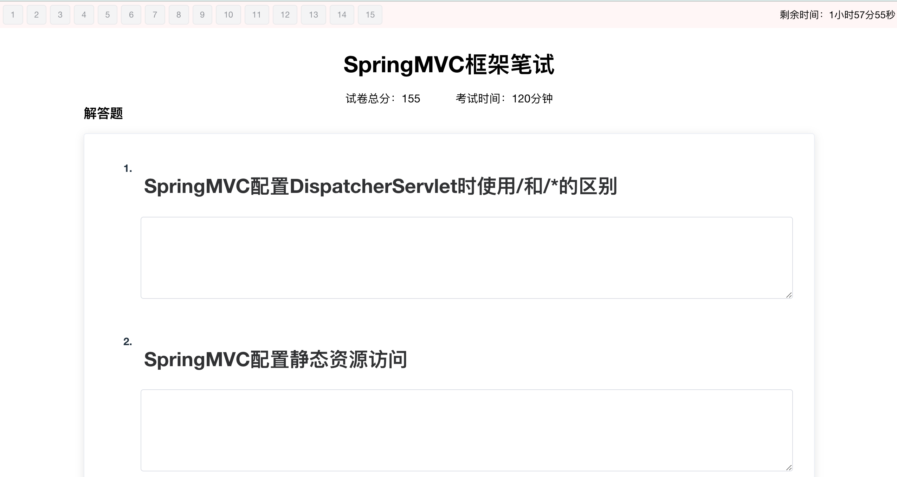
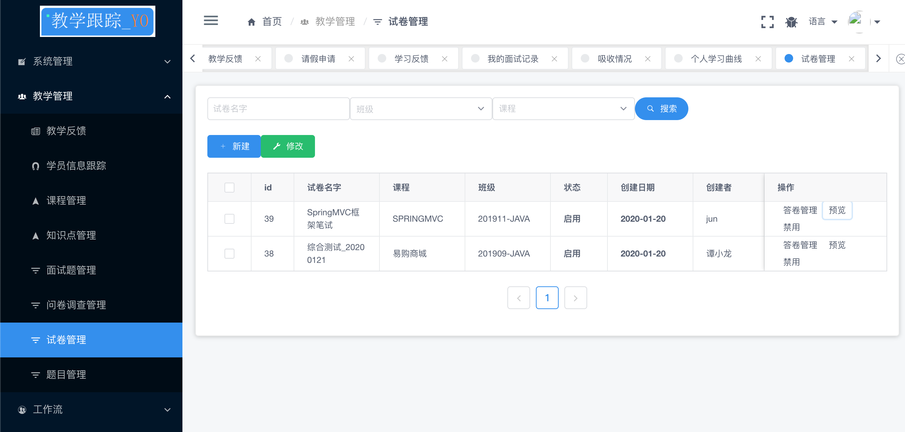
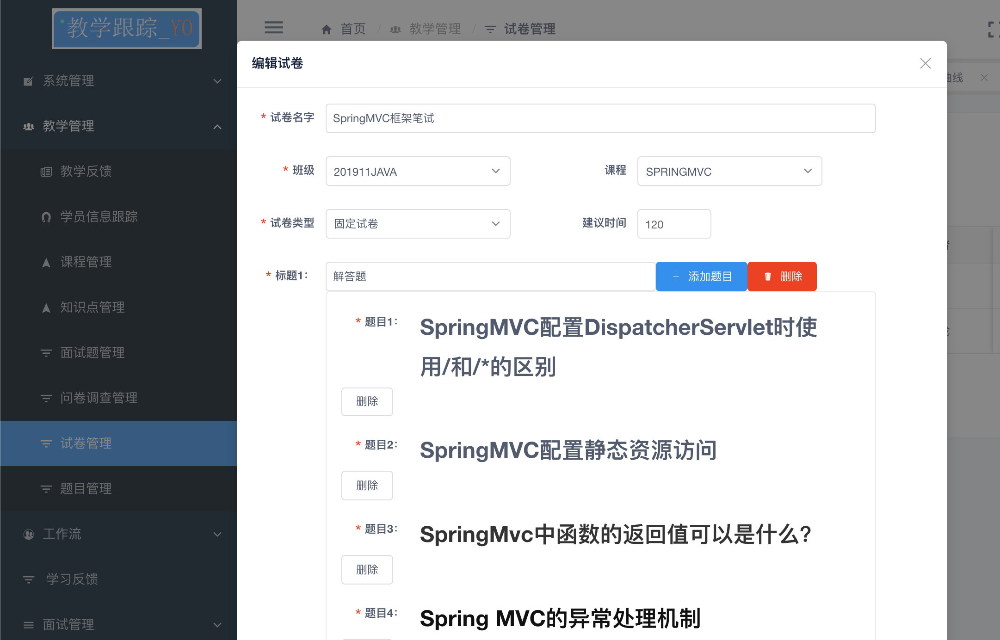
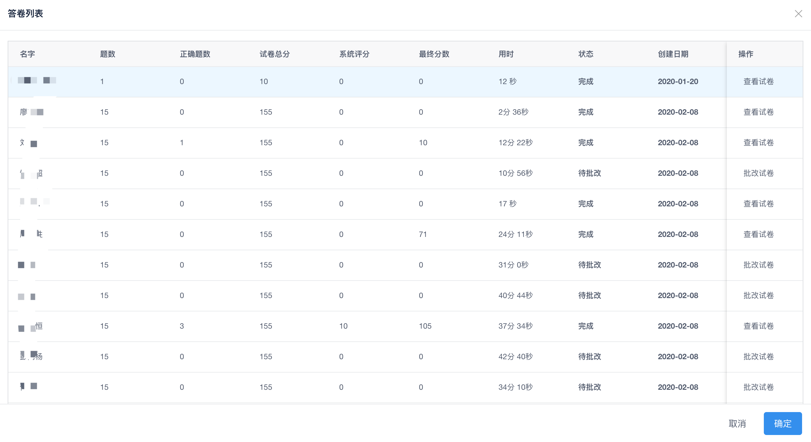

# 教学跟踪管理系统-学生在线考试ui

```

https://gitee.com/tamsiuloong/tqt-exam.git

```
# 技术体系
```
服务器:springboot+mysql
前 端:vue+iviewui+elementui
```


# 功能介绍

这套系统用于本人培训工作中管理系统，初衷是为了快速了解学员的吸收情况，减少公司和本人的工作量。

- 在线考试




- 教学管理

  - 试卷管理
  - 题目管理








## 其他系统

```

教学跟踪管理系统-admin管理ui
https://gitee.com/tamsiuloong/tqt-admin.git

教学跟踪管理系统-api服务器
https://gitee.com/tamsiuloong/tqt-api.git


```


## 数据库脚本
```
需要完整数据库sql请关注:
今日头条:JAVA在召唤
```


